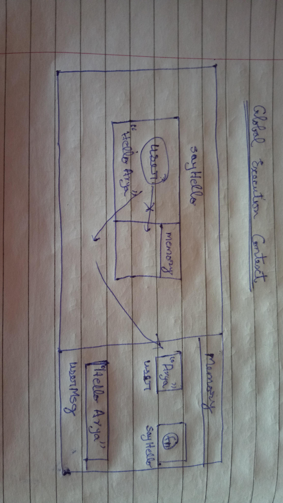
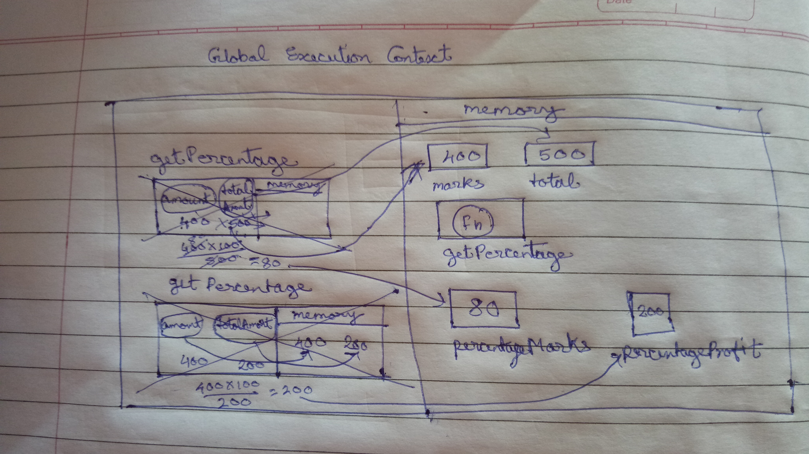
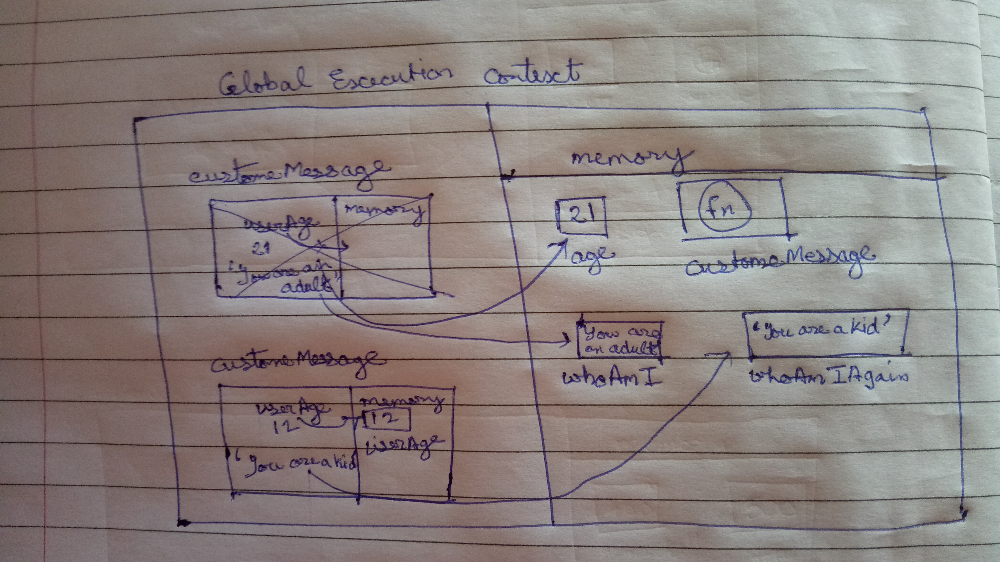

1. What does thread of execution means in JavaScript?    
Thread of execution is the piece of code that needs to be executed.

2. Where the JavaScript code gets executed?  
Inside JavaScript Engine

3. What does context means in Global Execution Context?  
Context is the environment in which the code is executed.

4. When do you create a global execution context.  
Global Execution Context is created only once for each program. It is created at the begining of execution.

5. Execution context consists of what all things?  
It consists of :  
* Memory
* Computation section

6. What are the different types of execution context?
* Global execution context  
* Functional execution context

7. When global and function execution context gets created?
* Global execution context is created only once at the start of execution of code. 
* Functional execution context is created every time a function is called.

8. Function execution gets created during function execution or while declaring a function.  
During function execution


9. Create a execution context diagram of the following code on your notebook. Take a screenshot/photo and store it in the folder named `img`. Use `` to display it here.


```js
var user = "Arya";

function sayHello(){
  return `Hello ${user}`;
}

var userMsg = sayHello(user);
```

<!-- Put your image here -->




```js
var marks = 400;
var total = 500;

function getPercentage(amount, totalAmount){
  return (amount * 100) / totalAmount;
}

var percentageMarks = getPercentage(marks, total);
var percentageProfit = getPercentage(400, 200);
```

<!-- Put your image here -->




```js
var age = 21;

function customeMessage(userAge){
  if(userAge > 18){
    return `You are an adult`;
  }else {
    return `You are a kid`;
  }
}

var whoAmI = customeMessage(age);
var whoAmIAgain = customeMessage(12);
```

<!-- Put your image here -->

