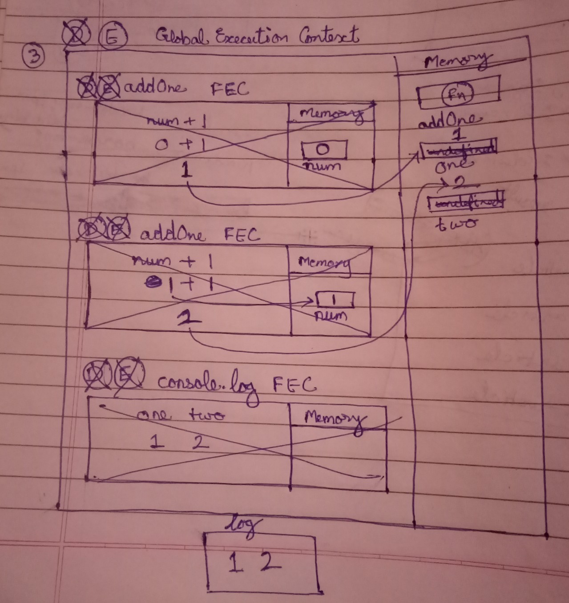
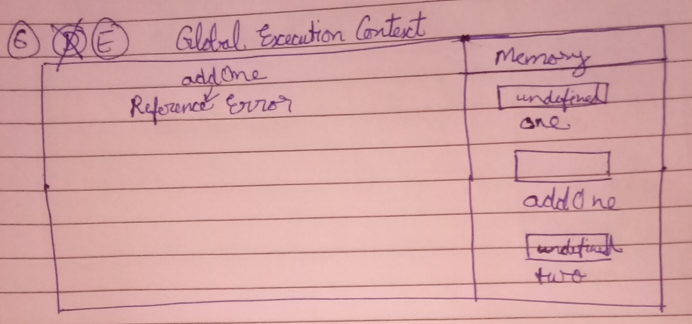
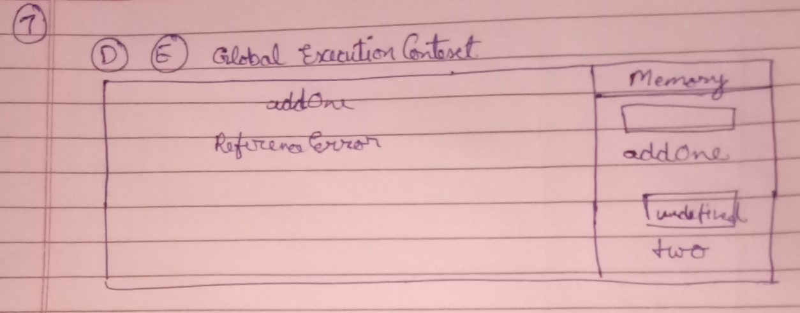

## Understanding Scope and the difference between var, let and const

Watch this video before doing the exercise: https://www.youtube.com/watch?v=XgSjoHgy3Rk

1. Guess the output:

```js
let firstName = 'Arya';
const lastName = 'Stark';
var knownAs = 'no one';

console.log(
  window.firstName,
  window.lastName,
  window.knownAs
);
//Output
undefined undefined "no one"
```

2. Guess the output:

```js
let firstName = 'Arya';
const lastName = 'Stark';
var knownAs = 'no one';

function fullName(a, b) {
  return a + b;
}

console.log(window.fullName(firstName, lastName));
//Output
AryaStark
```

3. Make a Execution Context Diagram for the following JS and write the output.

```js
function addOne(num){
  return num + 1;
}
var one = addOne(0);
var two = addOne(1);
console.log(one, two);  
//Output
1 2
```


4. Make a Execution Context Diagram for the following JS and write the output.

```js
var one = addOne(0);
function addOne(num){
  return num + 1;
}
var two = addOne(1);
console.log(one, two); 
//Output 
1 2
```


5. Make a Execution Context Diagram for the following JS and write the output.

```js
console.log(addOne(0));
function addOne(num){
  return num + 1;
}
var two = addOne(1);
console.log(two);
//Output
1
2
```


6. Make a Execution Context Diagram for the following JS and write the output.

```js
var one = addOne(0);
const addOne = (num) => {
  return num + 1;
};
var two = addOne(1);
console.log(two);
// Output
Uncaught ReferenceError: Cannot access 'addOne' before initialization
```


7. Make a Execution Context Diagram for the following JS and write the output.

```js
console.log(addOne(0));
const addOne = (num) => {
  return num + 1;
};
var two = addOne(1);
console.log(two);
//Output
Uncaught ReferenceError: Cannot access 'addOne' before initialization

```


8. What will be the output of the following

```js
function isAwesome() {
  var awesome;
  if (false) {
    awesome = true;
  }
  console.log(awesome);
}
isAwesome();
//Output 
undefined
```

9. What will be the output of the following

```js
function isAwesome() {
  let awesome;
  if (true) {
    awesome = true;
  }
  console.log(awesome);
}
isAwesome();
//Output
true
```

10. What will be the output of the following

```js
function isAwesome() {
  let awesome;
  if (false) {
    awesome = true;
  }
  console.log(awesome);
}
isAwesome();
//Output
Undefined
```

11. What will be the output of the following

```js
let firstName = 'Arya';
const lastName = 'Stark';
var knownAs = 'no one';

function fullName(a, b) {
  return a + b;
}
const name = fullName(firstName, lastName);
console.log(name);
//Output
AryaStark
```

12. Guess the output of the code below with a reason.

```js
function sayHello() {
  let name = 'Arya Stark';
}
sayHello();

console.log(name);
//Output
ReferenceError: name is not defined // name is defined inside sayHello() using let keyword. It is not accessible outside the function.
```

13. Guess the output of the code below with a reason.

```js
if (true) {
  var name = 'Arya Stark';
}
console.log(name);
//Output
Arya Stark  // name is accessible outside the if block as it is declared using var keyword.
```

14. Guess the output of the code below with a reason.

```js
if (true) {
  let name = 'Arya Stark';
}
console.log(name);
//Output
ReferenceError: name is not defined     //As name is declared using let keyword. It cannot be accessed outside the if block. 
```

15. Guess the output of the code below with a reason.

```js
for (var i = 0; i < 20; i++) {
  //
}
console.log(i);
//Output
20 // i is declared using var keyword and therefore it is accessible outside the loop when it's value becomes 20.
```

16. Guess the output of the code below with a reason.

```js
for (let i = 0; i < 20; i++) {
  //
}
console.log(i);
//Output
ReferenceError: i is not defined  // i has a block scope as it is defined using let keyword.

```

17. Guess the output and the reason behind that.

```js
function sample() {
  if (true) {
    var username = 'John Snow';
  }
  console.log(username);
}
sample();
//Output
John Snow // `username` is defined using var keyword. Hence it is accessible outside the if block.
```

18. Guess the output and the reason behind that.

```js
function sample() {
  if (true) {
    let username = 'John Snow';
  }
  console.log(username);
}
sample();
//Output
ReferenceError: username is not defined  // As username is defined using let keyword it has block scope and is not accessible outside if block.
```

19. Guess the output and the reason behind that.

```js
function sample() {
  var username = 'Arya Stark';
  if (true) {
    var username = 'John Snow';
    console.log(username);
  }
  console.log(username, 'second');
}
sample();
//Output
John Snow
John Snow second   // username is defined using var keyword hence it is accessible outside the if block
```

20. Guess the output and the reason behind that.

```js
function sample() {
  let username = 'Arya Stark';
  if (true) {
    let username = 'John Snow';
    console.log(username, 'first');
  }
  console.log(username, 'second');
}
sample();
//Output
John Snow first
Arya Stark second // the value of username outside if block
```

21. Guess the output and the reason behind that.

```js
function sample(...args) {
  for (let i = 0; i < args.length; i++) {
    let message = `Hello I am ${args[i]}`;
    console.log(message);
  }
}

sample('First', 'Second', 'Third');
//Output
Hello I am First
Hello I am Second
Hello I am Third   // ...args stores all the arguments passed to the function. And the for loop is repeated for all the arguments.
```

22. Guess the output and the reason behind that.

```js
function sample(...args) {
  for (let i = 0; i < args.length; i++) {
    const message = `Hello I am ${args[i]}`;
    console.log(message);
  }
}

sample('First', 'Second', 'Third');
//Output
Hello I am First
Hello I am Second
Hello I am Third  // there is no error even when we are assigning value to const variable because every time a loop is run a new block is created 
                  // and in that block new message variable is created.
```

23. Guess the output and the reason behind that.

```js
if (true) {
  const myFunc = function () {
    console.log(username, 'Second');
  };
  console.log(username, 'First');
  let username = 'Hello World!';
  myFunc();
}
//Output
ReferenceError: Cannot access 'username' before initialization // As the value of username is logged before it is initialised
```

24. Guess the output and the reason behind that.

```js
function outer() {
  let movie = 'Mad Max: Fury Road';
  function inner() {
    console.log(
      `I love this movie called ${movie.toUpperCase()}`
    );
  }
  inner();
}

outer();
//Output
I love this movie called MAD MAX: FURY ROAD  // Inside the inner() 'movie' variable is accessed. As 'movie' is not present in the memory of inner(), 
                                             // it bubbles out and  finds it inside inner().
```

25. Guess the output and the reason behind that.

```js
function outer() {
  let movie = 'Mad Max: Fury Road';
  function inner() {
    let movie = 'Before Sunrise';
    console.log(
      `I love this movie called ${movie.toUpperCase()}`
    );
  }
  inner();
}

outer();
//Output
I love this movie called BEFORE SUNRISE   // the variable `movie` is present inside inner(), hence that value is accessed.
```

26. Guess the output and the reason behind that.

```js
function outer() {
  let movie = 'Mad Max: Fury Road';
  function inner() {
    let movie = 'Before Sunrise';
    function extraInner() {
      let movie = 'Gone Girl';
      console.log(
        `I love this movie called ${movie.toUpperCase()}`
      );
    }
    extraInner();
  }
  inner();
}
outer();
//Output
I love this movie called GONE GIRL   // the variable `movie` is present inside extraInner(), hence that value is accessed.
```

30. Using reduce find the final value when the initial value passed is `100`. You have to pass the output of one function into the input of next function in the array `allFunctions` starts with `addOne` ends with `half`.

```js
const addOne = (num) => {
  return num + 1;
};
const subTwo = (num) => {
  return num - 2;
};
const multiplyThree = (num) => {
  return num * 3;
};
const half = (num) => {
  return num / 2;
};

let allFunctions = [
  addOne,
  subTwo,
  multiplyThree,
  addOne,
  multiplyThree,
  half,
];

let val = allFunctions.reduce((acc, cv) => {
    acc =cv(acc);
  return acc;
}, 100);
console.log(val);
// Answer is: 447
```
